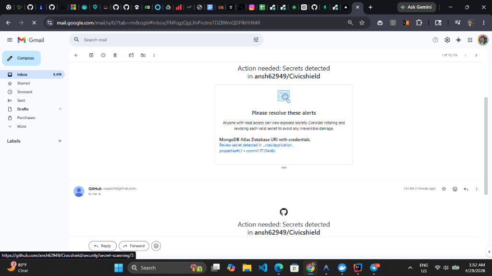
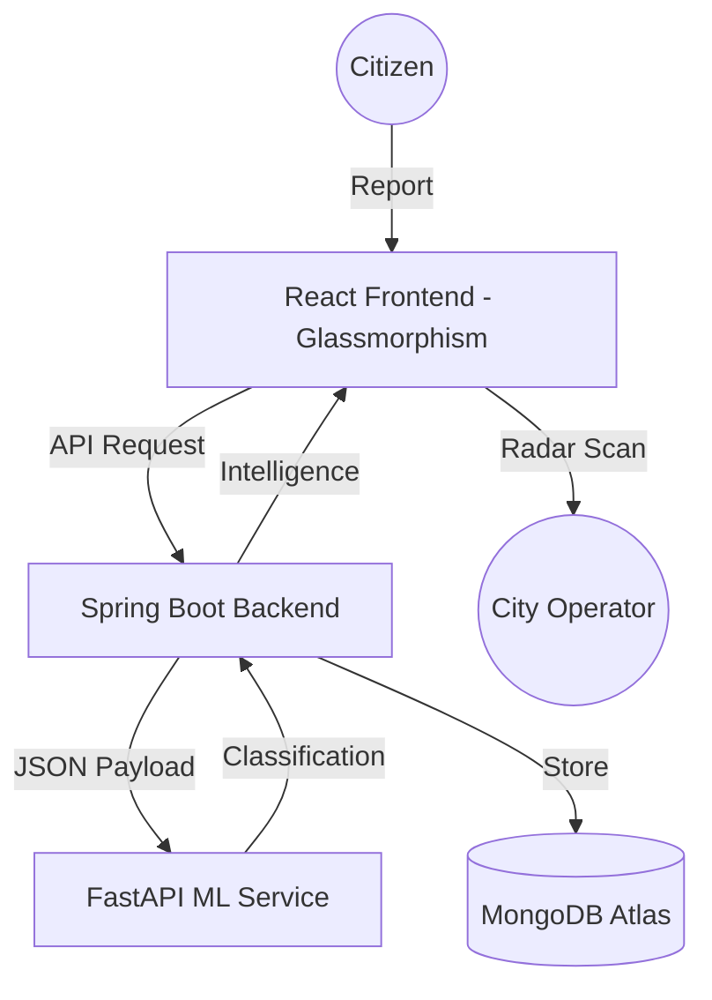

# 🛡️ CivicShield: AI-Driven Civic Intelligence Platform

[](https://civicshield-ten.vercel.app/)
[](https://github.com/ansh62949/Civicshield)
[](LICENSE)

**CivicShield** is a premium, AI-powered intelligence platform designed to transform how citizens interact with their urban environment. It bridges the gap between public reports and government action by leveraging high-speed machine learning, real-time predictive analytics, and a futuristic, high-fidelity user interface.

---

## 🛰️ Intelligence Dashboard

*Real-time neon radar scanner tracking active civic threat vectors.*

---

## 🌟 Key Innovations

### 1. 🤖 Smart AI Triage Engine
Automatically classifies and prioritizes civic complaints using a lightweight, zero-bloat NLP & Vision pipeline. 
- **Automated Categorization**: Instant detection of `ROAD`, `GARBAGE`, `WATER`, `CRIME`, and `SAFETY` issues.
- **Dynamic Severity Escalation**: AI analyzes keywords (e.g., "danger", "accident") to trigger immediate `CRITICAL` alerts.
- **Transparency**: Every report displays an **AI Confidence Score** to ensure data integrity.

### 2. 🛰️ Neon Radar Scanner
A futuristic geospatial monitoring tool for city operators.
- **Vector Analysis**: Visualizes active reports as glowing threat markers on a high-fidelity map.
- **Scanner Sweep**: Real-time animation of active monitoring zones.
- **HUD Tooltips**: High-tech interactive popups for instant report data access.

### 3. 📊 AI Predictive Insights
Transforms raw data into actionable urban intelligence.
- **Growth Analysis**: Tracks category trends with week-over-week growth percentages.
- **Hotspot Detection**: Identifies rising issues in specific sectors before they escalate.

### 4. 💎 Premium Dark UI
A state-of-the-art interface built with **Glassmorphism** and a "Deep Space" aesthetic.
- **Futuristic HUD**: HUD-style navigation and telemetry bars.
- **Neon Interaction System**: Consistent glowing feedback for all user actions.
- **High-Fidelity Badging**: Refractive glass badges for AI-verified intelligence metadata.

---

## 🏗️ System Architecture



---

## 🛠️ Tech Stack

| Component | Technology | Description |
|-----------|------------|-------------|
| **Frontend** | React, Vite, Framer Motion, Tailwind CSS | High-performance, animated UI with Glassmorphism |
| **Backend** | Java 17, Spring Boot, Spring Security | Scalable microservice with JWT & MongoDB integration |
| **AI Layer** | Python 3.11, FastAPI, Scikit-learn | Lightweight ML service optimized for 512MB RAM |
| **Database** | MongoDB | Flexible schema for diverse civic data streams |
| **Design** | HSL Tailored Palettes, CSS Glass | Premium "Deep Space" visual design system |

---

## 🚀 Deployment

The platform is optimized for cloud environments with strict resource limits:
- **Frontend**: Deployed on [Vercel](https://civicshield-ten.vercel.app/)
- **Backend**: Deployed on [Render](https://civicshield-1-om60.onrender.com) (optimized for Free Tier)
- **AI Service**: Dedicated lightweight FastAPI instance.

---

## 💻 Local Setup

### 1. Clone & Configure
```bash
git clone https://github.com/ansh62949/Civicshield.git
cd Civicshield
```

### 2. Backend (Java)
```bash
cd civicshieldbackend
./mvnw spring-boot:run
```

### 3. AI Service (Python)
```bash
cd ai-service
pip install -r requirements.txt
python app.py
```

### 4. Frontend (React)
```bash
cd civicSense
npm install
npm run dev
```

---

## 🤝 Roadmap
- [x] Phase 1: AI Integration & Backend Core
- [x] Phase 2: Premium UI/UX Overhaul
- [x] Phase 3: Real-time Radar & Trending Insights
- [ ] Phase 4: Image Classification (Vision API)
- [ ] Phase 5: AI-Driven Authority Routing

---

## 📄 License
Distributed under the MIT License. See `LICENSE` for more information.

---
**Developed with 🛡️ CivicShield AI Team**
